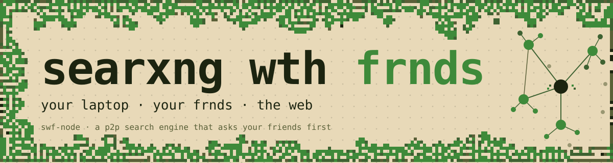

<p align="center">
  
</p>

# swf-node

> ⚠️ **Not yet friendly to run.** swf-node is research-quality code with no official release. Install paths exist (Docker, git-install) and the daemon runs, but expect rough edges and breaking changes between commits. If you're not comfortable reading the source when something doesn't work, wait for a tagged release.

> 🌱 **Used for more than search inside Shape Rotator.** Inside the [Shape Rotator program](https://shaperotator.xyz), the node currently doubles as a basic substrate for sharing things beyond search indexes. It works today because the substrate is simple. Those uses will eventually live elsewhere.

[](LICENSE)

## Downloads

Every tagged release ships pre-built PyInstaller single-file binaries (no Python runtime required on the host) on the [Releases page](https://github.com/dmarzzz/searxng-wth-frnds/releases). Asset names follow a fixed pattern so embedding hosts can resolve them without parsing the release body:

```
swf-node-<version>-mac-arm64
swf-node-<version>-mac-x64
swf-node-<version>-linux-x64
swf-node-<version>-linux-arm64
```

`<version>` is the git tag minus the leading `v` (e.g. tag `v0.8.0` → asset suffix `0.8.0`). Windows binaries are not produced today; it's tracked as a feature request.

These binaries are intended for **embedding**: hosts like the [Shape Rotator OS](https://shaperotator.xyz) Electron app fetch the matching `(os, arch)` asset for each release and spawn it as a sidecar daemon. The binary is self-contained, runnable from an arbitrary working directory (state lives under `~/.local/share/swf/` regardless of where you start it from), and accepts the same `--bind` / `--port` / `--no-mdns` flags (and `SWF_BIND` / `SWF_PORT` / `SWF_NO_MDNS` env vars) as a pip-installed `swf-node`.

There are two embedding shapes — pick the one that matches what the host app is trying to do:

- **LAN-peer embedded** (the Shape Rotator OS case — what most embedders will want). The host app wants cohort peers on the same LAN to discover and gossip with this node. Spawn with `--bind 0.0.0.0` (or set `SWF_BIND=0.0.0.0`) and **leave mDNS on** (the default — don't pass `--no-mdns`, don't set `SWF_NO_MDNS=1`). swf-node auto-enables mDNS advertising whenever the bind is non-loopback, so no extra flag is needed. On macOS 15+, the host app needs `NSLocalNetworkUsageDescription` in its `Info.plist` so the OS can prompt the user for local-network access on first launch.

- **Loopback-only embedded** (no LAN peers, app-internal data store). The host app wants swf-node purely as a local data plane — only the host process talks to it, no LAN neighbors involved. Spawn with `--bind 127.0.0.1 --no-mdns` (or `SWF_BIND=127.0.0.1 SWF_NO_MDNS=1`). swf-node also auto-disables mDNS on a loopback bind, so the `--no-mdns` is belt-and-suspenders — useful as an explicit signal to readers of the spawn args.

If you're not sure which one you want and the host is a multi-user/multi-device product, you want the **LAN-peer** shape. That's the whole reason swf-node exists.

swf-node is a p2p search engine that asks your friends first, forked from [searxng](https://github.com/searxng/searxng). Why ask the public internet when the friend next to you already has what you need? Right now it is a search engine for agents, dogfooded today as the backend for the [research-swarm](https://github.com/dmarzzz/research-swarm) DSPy ReAct loop. Human-facing UI work is downstream.

When you ask swf-node something, it looks first at the pages already on your laptop, every page you've opened through it, full-text searchable, on disk, no network. If your machine doesn't have what you asked for, it asks your friends, a small handful of people you've added by hand, whose nodes share the LAN, whose own searching has overlapped with yours the way friends' interests tend to overlap. Only when neither layer answers does the query reach the public web, and only through the searxng layer it inherits. Searxng states plainly that its users are neither tracked nor profiled, and it can be run over Tor when that matters.

It works. It is early. The local archive and friend search ship today; the strongest privacy property, unobservability inside the friend circle, is still landing.

## Quick start for agents

```bash
pipx install "git+https://github.com/dmarzzz/searxng-wth-frnds.git"
swf-node &                              # binds 127.0.0.1:7777
curl -s http://127.0.0.1:7777/health    # {"ok": true, ...}
```

The daemon auto-creates an identity and config on first run; no setup step required. Point your agent at `POST http://127.0.0.1:7777/web_search` with a JSON body like `{"q": "your query", "top_k": 5}`. A copy-paste Python example lives at [`examples/agent_quickstart.py`](examples/agent_quickstart.py).

```
        your query
            │
            ▼
   ┌──────────────────────────┐
   │ 1. pages on your laptop  │   what you've already opened
   └──────────┬───────────────┘
              │ miss
              ▼
   ┌──────────────────────────┐
   │ 2. your friends' indexes │   trusted peers, on the LAN
   └──────────┬───────────────┘
              │ miss
              ▼
   ┌──────────────────────────┐
   │ 3. the public web        │   via the searxng layer
   └──────────────────────────┘
```

## Why a p2p search engine that asks your friends first

Centralized search wasn't wrong, but it was built for a different reader. Twenty-five years of one-size-fits-all, tuned for the head of human curiosity: short queries, common pages, ad-supported results. The way you actually research something (repeat what you've already asked, drill into a lead, chase the long tail, then do all of that again in another context) barely registers in that distribution. The way an agent does it on your behalf registers even less.

The premise behind swf-node is that most of what you search for, you've searched before, and the people you trust have probably touched the territory next door. A new search engine, built for that, looks at what's nearby before it looks anywhere else.

The seed of the project was [Vitalik's case for local-first AI](https://vitalik.eth.limo/general/2026/04/02/secure_llms.html): the substrate an agent runs on shouldn't depend on a centralized vendor. The same logic applies one layer up. The substrate an agent searches through shouldn't either.

## What happens when you ask it something

**Your local index.** Every page that comes back through swf-node gets stored on your disk and added to a full-text index. The next time you search for it, or for anything in its text, the answer comes from your own machine. No network round-trip, no rate limit, no upstream tracking. Over time, the index becomes a kind of working memory of the web you actually use.

**Your friends' indexes.** A trusted circle, added by hand. Nodes find each other on the LAN automatically; cross-network peers can be pinned by URL. Each friend periodically shares the part of their index they choose to share, signed by their key so you know it came from them. The result is a community-curated long tail with no crawler running anywhere. The indexing is the side effect of people you trust doing their own searching.

**The public web, when nothing closer answers.** The searxng layer this project forks from is still there, doing the work it was built for: querying the major engines, merging the results, keeping you out of their tracking surface. swf-node just makes it the fallback rather than the front.

## Privacy: searxng's defaults, one step further

What you inherit from searxng is real. Searxng [does not track or profile its users](https://docs.searxng.org/), and it can be deployed as a Tor onion service when the situation calls for it. Self-hosting is the default deployment shape. Whatever IP exposure you would otherwise hand to Google or Bing belongs to the searxng instance, not your browser.

The friend circle takes that one step further. Once a small group of trusted nodes is running together, those nodes can act as a [DC-net](https://en.wikipedia.org/wiki/Dining_cryptographers_problem) group: an anonymous-broadcast primitive where a query leaving the group cannot be attributed to any single member, including by the other members. The property is information-theoretic, not cryptographic. The DC-net hides *who* asked. It does not hide *what* was asked.

Reputation inside the circle (who's been a good citizen, whose contributions to consult next) runs on anonymous tickets, blind tokens of the Privacy Pass family, so those signals don't double as a tracking trail.

Some of this ships today. Some of it lands as the underlying primitives stabilize; see [`TODO.md`](TODO.md) and [`docs/THREAT_MODEL.md`](docs/THREAT_MODEL.md) for the line between the two.

## What it isn't

- Not a public crawler. swf-node only ever sees pages you've sent it to.
- Not a multi-tenant service. One identity per config directory, one user per node.
- Not hardened for the open internet. Put it behind Caddy or nginx if you expose it.
- Not on Docker Desktop for laptop peer mode. The macOS/Windows VM doesn't pass mDNS through; use the native install path.

## Install

v0.8.0 ships via **Docker + git-install**. PyPI is deferred ([`TODO.md`](TODO.md)).

```bash
# Linux server, primary path (host networking for mDNS):
docker run --network host \
    -v "$HOME/.config/swf:/home/swf/.config/swf" \
    -v "$HOME/world_knowledge:/home/swf/world_knowledge" \
    ghcr.io/dmarzzz/swf-node:v0.8.0

# Or native (macOS, Windows, Linux laptop peer mode):
pipx install "git+https://github.com/dmarzzz/searxng-wth-frnds.git@v0.8.0"
swf-node           # auto-creates identity + config on first run, then listens on 127.0.0.1:7777
```

If you want to write the config skeleton (or rotate the identity) without starting the daemon, `swf-node init` does that explicitly.

Full setup recipe in [`docs/QUICKSTART.md`](docs/QUICKSTART.md). Point your agent at `POST http://127.0.0.1:7777/web_search`, or use swf-node as a long-running search backend over HTTP.

## Read more

- [`drafts/post.md`](drafts/post.md). The long-form research sketch behind this project: three ideas (local-first index, searxng with friends, anonymous broadcast), where they came from, what they aggregate into.
- [`DESIGN.md`](DESIGN.md). System architecture and module boundaries.
- [`INDREX.md`](INDREX.md). The local-index spec.
- [`docs/HTTP_API.md`](docs/HTTP_API.md). Endpoint reference.
- [`docs/THREAT_MODEL.md`](docs/THREAT_MODEL.md). Threat model and privacy posture.

MIT. See [`LICENSE`](LICENSE).
